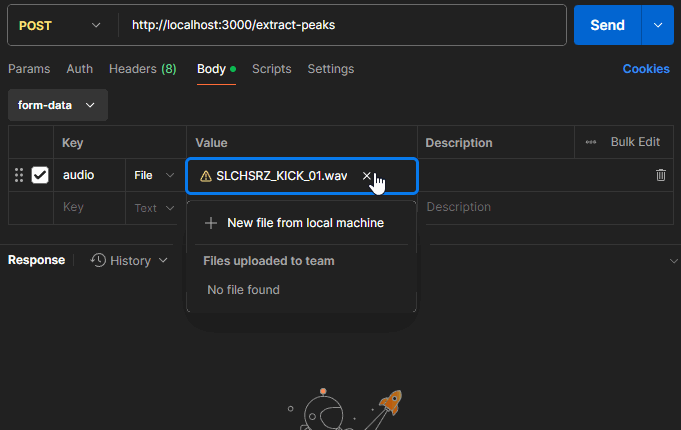

# WaveSurfer Peaks Extractor API


A simple Node.js microservice that extracts audio peaks (suitable for [WaveSurfer](https://wavesurfer.xyz/) or other waveform visualizations) from an uploaded audio file. Uses [Express](https://github.com/expressjs/express) for handling HTTP requests and [FFMpeg](https://github.com/FFmpeg/FFmpeg) for audio processing.

## Features

- Accepts an audio file (`.wav`, `.mp3`, etc.) via `POST /extract-peaks`.
- Converts the file to PCM data (mono, 44.1 kHz, s16le).
- Calculates peaks.
- Returns peaks as JSON (e.g., `[ [0.0, 0.1, 0.9, ... ] ]`).

## Requirements

- [Node.js](https://nodejs.org/) >= 18
- [FFmpeg](https://www.ffmpeg.org/download.html) installed and accessible in your system's PATH.

Or run everything in [Docker](https://www.docker.com/) (with FFmpeg included).

## Installation

1. Clone this repository:
   ```bash
   git clone https://github.com/Sakhnovkrg/WaveSurfer-Peaks-Extractor-API.git
   cd WaveSurfer-Peaks-Extractor-API
   ```

2. Install dependencies:
   ```bash
   npm install
   ```

3. Make sure **FFmpeg** is installed on your machine (if running locally).

## Usage

### Local (Node)

1. Start the service:
   ```bash
   npm start
   ```

2. Send an audio file to the `/extract-peaks` endpoint:
   ```bash
   # peakCount determines the number of peaks to extract (default: 512). Higher values provide more detailed data.

   curl -X POST "http://localhost:3000/extract-peaks?peakCount=1024" -F "audio=@audiofile.wav"
   ```
   The response will be a JSON object containing an array of normalized peak values.

### Docker

- For development:
   ```bash
   docker-compose up dev -d
   ```
- For production:
   ```bash
   docker-compose up prod -d
   ```
[DockerHub Repository](https://hub.docker.com/r/sakhnovkrg/wavesurfer-peaks-extractor-api-prod)
